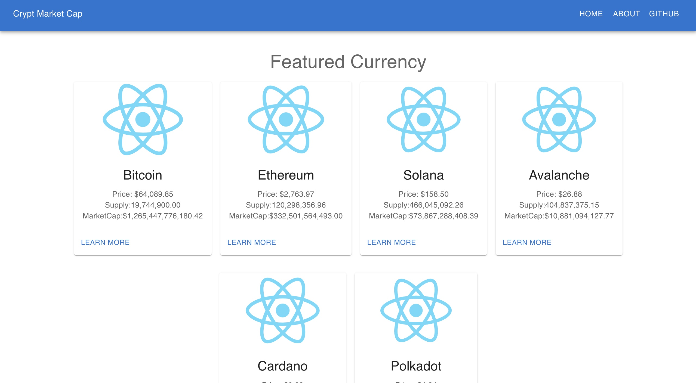
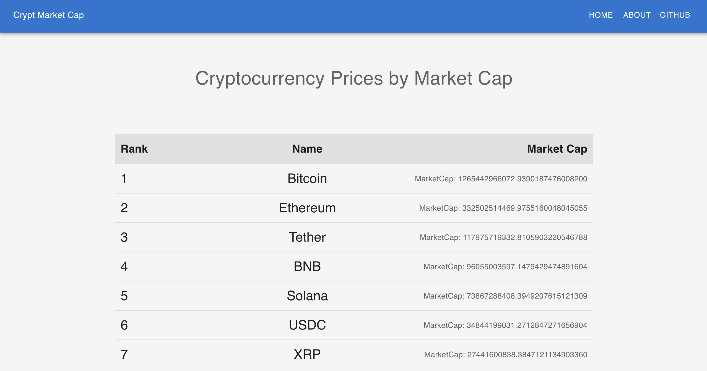

# 概要

ご覧いただき、ありがとうございます 
仮想通貨のマーケット情報を見ることができるWEBサイトです  
上段では代表して5つの銘柄の情報を、中段では時価総額ランキングを確認することができます 
データはすべて[CoinCap](https://coincap.io/)から引用しています 
※開発途中

## サイトイメージ
- 5つの銘柄  

- 時価総額ランキング

- ファビコンは生成AIを活用↓ 
  https://favicon.io/

## 使用技術
<フロントエンド>
- React v18.3.1
- Material-UI 
<バックエンド>
- Ruby v3.1.2
- Rails v6.1.7.8 
<インフラ> 
データベースをRDSにできればそれがベストでしたが、費用がかかるゆえEC2インスタンス内にしました

## 機能
- CoinCap API2.0との通信
- NewsAPIとの通信
- バックエンドサーバーとの通信(Ruby on Rails API)
## 開発にあたり注意した点
- なるべくコードを書かない  
  業務で開発をするとなると、他の人間が見ても理解しやすいようにすなコーディングが求められると考えたため  
  短く、簡潔に描くことを意識しました
- 既存技術(Material-UI) の利用  
  以下２点のメリットがあると考え上記技術を利用しました 
  &#9675; 業務を意識した開発ができる 
  &#9675; 閲覧者が見て違和感のないサイトを作れる 
0からのコーディングでは、どこかでコードが複雑になってしまったり、 
要素の配置を後から見直しにくなってしまったりと不都合が生じやすいと考えました。 
以上の理由から、コードの修正をしやすく、見た目も良くなるMaterial-UIを利用しました
  
